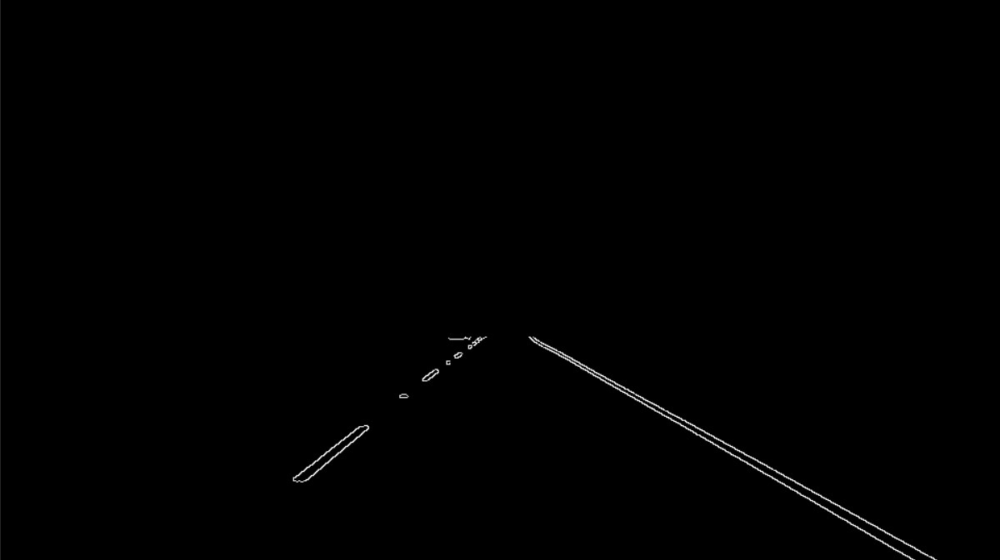
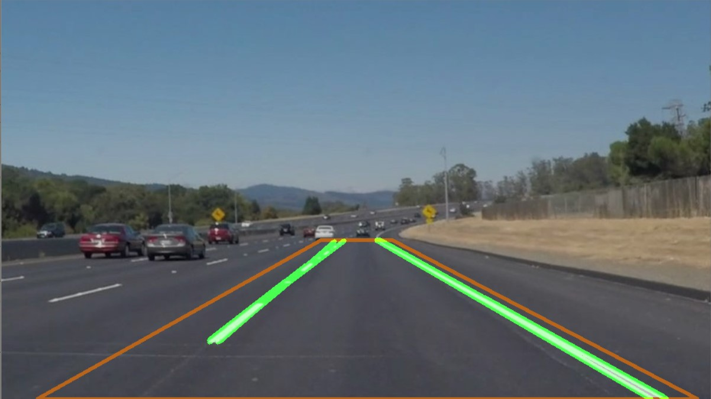
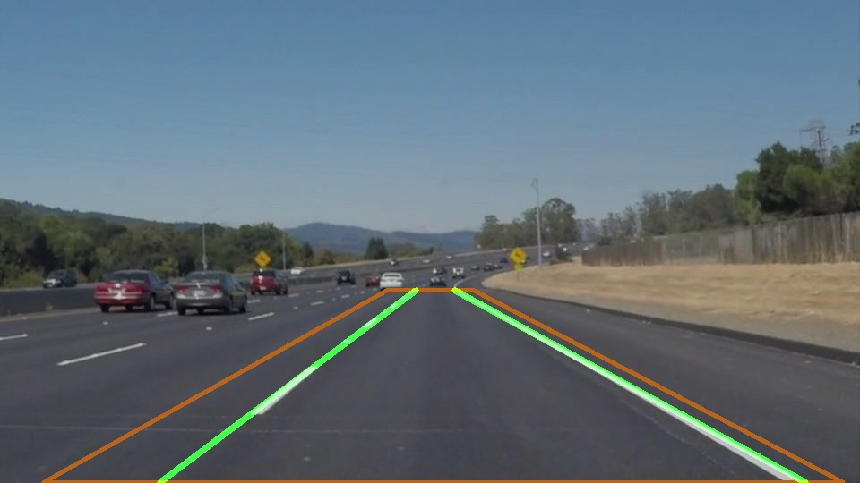

# **Finding Lane Lines on the Road**
## Lixing, Zhang

---

**Finding Lane Lines on the Road**

This markdown file explains all the designing trivials of my project for project 1 of the Udacity course "Self-Driving Car Engineering".

---

### 1. Pipeline Designing

**The pipeline consists altogether 4 steps, which I would explain below in detail.**
#### Step 1: Establish the Canny Edge Detector and Adjust its parameters
The first several steps are pretty straight-forward. It's just a round-up of everything I learned inside the course. I first created the helper function ``image_show(Img, name='image')`` to show an image.

Deploying the canny edge detector alone, the result would be like this,

#### Step 2: Select region of interest inside the edge map.
The function ``line_vertices(img_BGR)`` is created for defining vertices of the region to be subtracted. It takes an Image object as imput and return a vertices list and a lines list which are just different representation of edges.
#### Step 3: Establish the Hough Transmission and Adjust its parameters.
With the final step, Hough Transmission added, I finished the pipeline function ``image_processing_pipeline(f_name)`` which takes a raw Image object and returns one with lane lines drawn on it.

The final output image looks like this,

Which doesn't 100% meets our expectation.
#### Step 4: Draw the 2 lane lines based on the Hough Edges.
To give a more accurate result, I wrote the helper function `hough2lane_lines(hough_line_list, img)`. In the function, all hough edges detected would be grouped into 2 line groups, representing the left and right lane lines. An average k would then be calulated and the line would be expanded till the upper/lower boarder of the vertices defined before.

A result image:

#### Step 5: Improved the detector a little bit
In the challenge session, I found the pipeline workes poorly under strong sunlight and curvations. Adjusting parameters carefully might be a solution, but won't be a permanent one. Here I just reselected all parameters for functions above. As a result, though, the lane lines still oscilates a lot in some frames.

### 2. Assessment on the Pipeline
#### Testing Result
#### Short-Commings

### 3. Potential Improvements of the Pipeline
#### 1) Build a GUI tool for parameter adjusting
#### 2) Take curved lane lines into consideration
